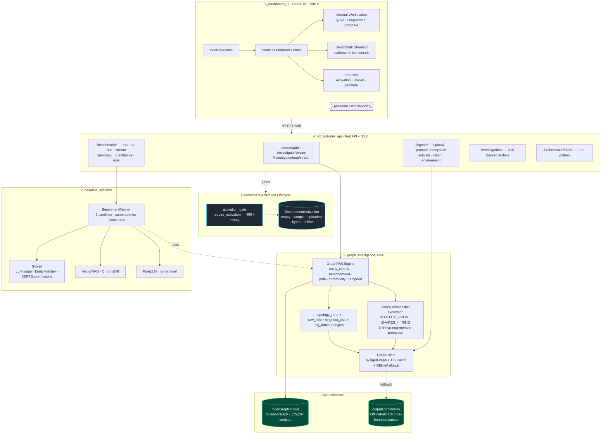
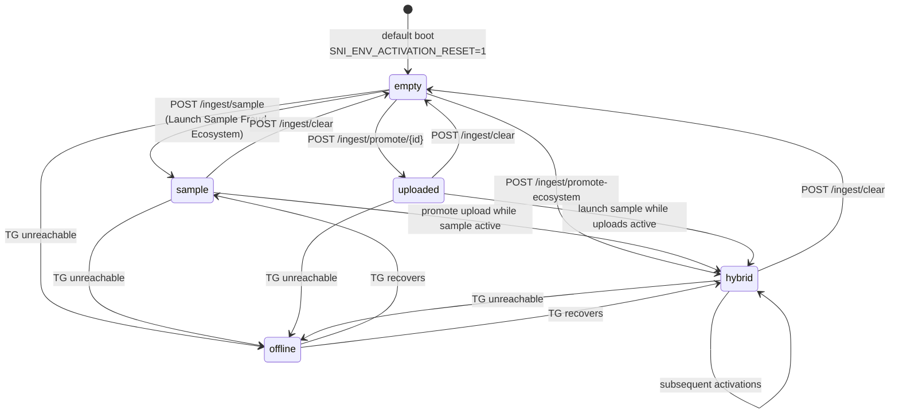
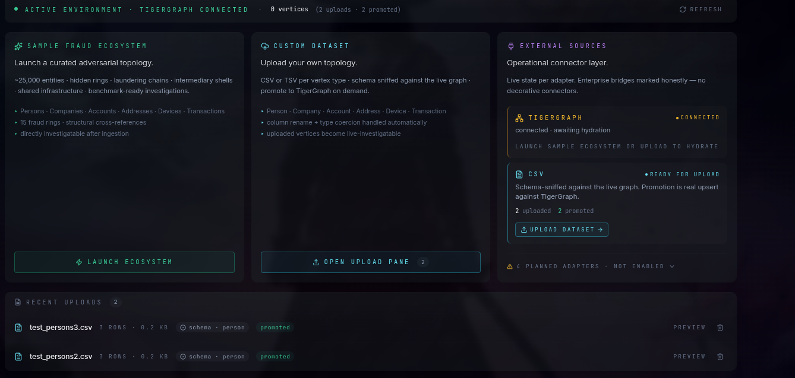
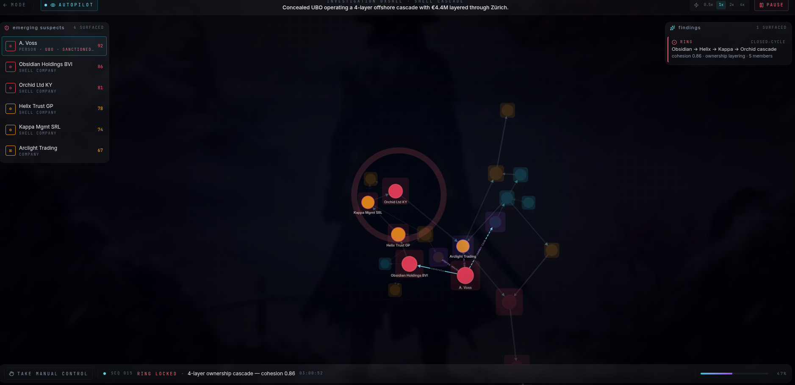
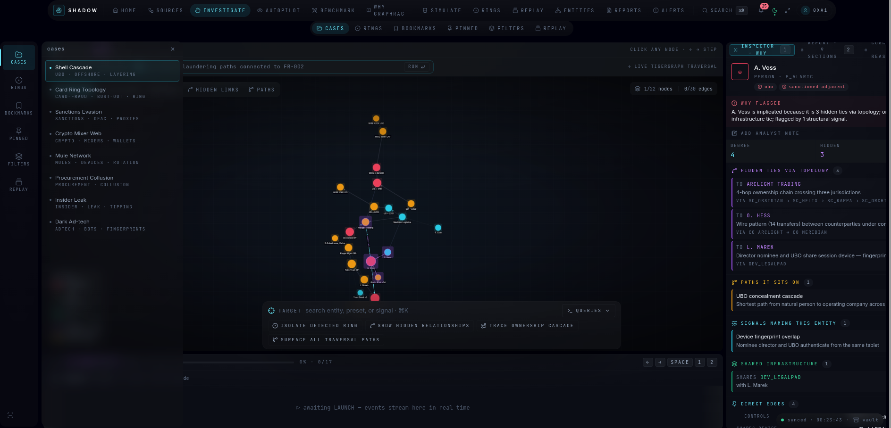
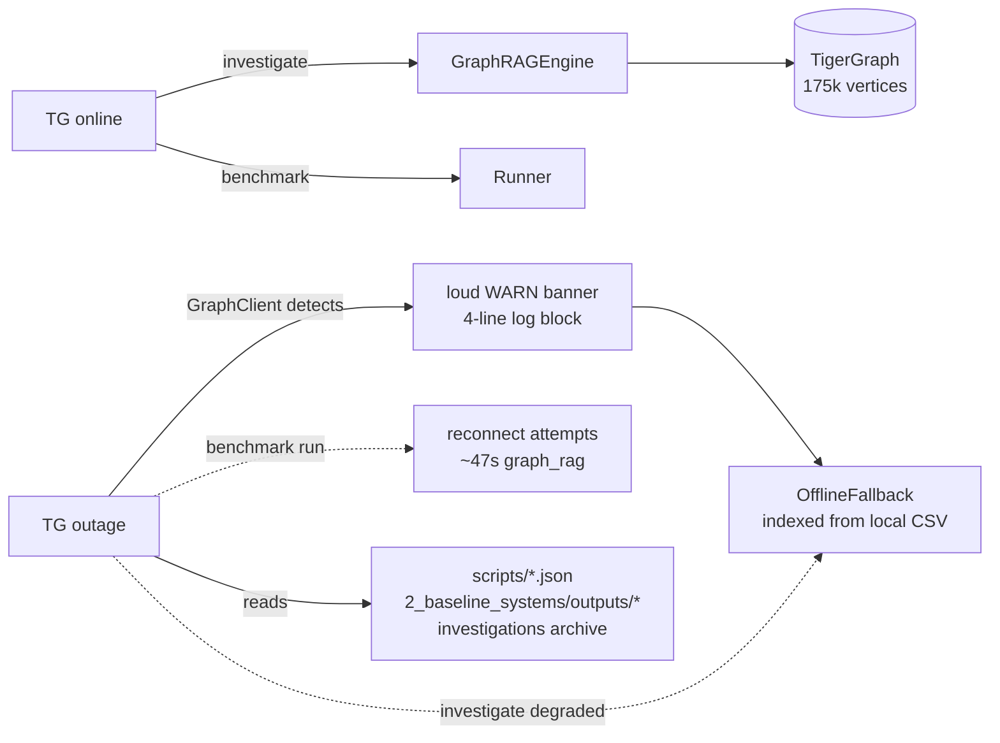

<div align="center">

# Shadow Network Intelligence

### *The answer is an edge, not a sentence.*

A research-grade **GraphRAG** investigation platform built on a live
**TigerGraph Cloud** graph (175,204 vertices · 373,439 edges · 6 populated
reverse-edge types), with three side-by-side retrieval paradigms,
operator-controlled environment activation, and a disclosure-first
benchmark surface.

[](#tests--reproducibility)
[](#tech-stack)
[](#tech-stack)
[](#live-tigergraph-topology)
[](./LICENSE)

</div>

<!-- SCREENSHOT_SLOT: hero-investigation.png · flagship · width=95% · framing notes: docs/screenshots/README.md#1 -->

---

## Why this exists

Financial-crime intelligence is a **relationship problem** disguised as
a search problem. Regulators don't ask *"give me documents about this
account"* — they ask *"who is laundering through this ring, and how is
the money moving."* That question has three properties that make
traditional retrieval categorically wrong:

1. **The answer is an edge**, not a sentence
2. The relevant entities **don't appear together** in any single document
3. Hidden relationships are **typed**, not textual (`SHARES_DEVICE_WITH`, `BENEFITS_FROM`, `PERSON_MEMBER_OF_RING`)

```
                                     ┌───────────────────────────────────────┐
                                     │  "Find members of fraud ring FR-001"  │
                                     └────────────────┬──────────────────────┘
                                                      │
              ┌───────────────────────────────────────┴──────────────────────────────────────┐
              │                                                                              │
              ▼                                                                              ▼
   ┌────────────────────┐                                                       ┌──────────────────────────┐
   │     VectorRAG      │                                                       │         GraphRAG         │
   ├────────────────────┤                                                       ├──────────────────────────┤
   │ retrieves chunks   │                                                       │ retrieves STRUCTURE      │
   │ that mention       │                                                       │                          │
   │ "FR-001" in text   │                                                       │ FR-001                   │
   │                    │                                                       │   ├─ACCOUNT_MEMBER_OF_…  │
   │ → fragmented       │                                                       │   │   ├─ A-006696        │
   │ → no edges         │                                                       │   │   ├─ A-008567        │
   │ → no ring graph    │                                                       │   │   └─ A-006948        │
   │                    │                                                       │   └─TRANSACTION_MEMBER…  │
   │ structural         │                                                       │       └─ TX-…            │
   │ recovery: 0/20     │                                                       │                          │
   │ (definitional)     │                                                       │ 8 typed ring edges       │
   │                    │                                                       │ 160 neighbors traversed  │
   └────────────────────┘                                                       └──────────────────────────┘
```

This platform proves — quantitatively, reproducibly, and operationally —
that **structural intelligence emerges from relationship topology, not
from larger prompts**.

Deep design rationale lives in [`10_research/`](./10_research/). The
files are numbered in the order they were written; the headline read is
[`10_research/04_vectorrag_limitations.md`](./10_research/04_vectorrag_limitations.md).

---

## 60-second TL;DR

|  | What |
|---|---|
| **Live substrate** | TigerGraph Cloud · `ShadowGraph` · 175,204 vertices · 373,439 edges · 7 vertex types · 19 forward + 6 reverse edge types · 2 installed GSQL queries (`tg_ring_members`, `tg_shortest_path`) |
| **Three pipelines, same queries** | `PureLLM`, `VectorRAG` (ChromaDB), `GraphRAG` (TigerGraph traversal + topology-aware rerank + ring-member promotion + 2nd-hop hidden-relationship expansion) |
| **Adversarial structural eval** | 20 queries hand-picked to require multi-hop traversal or hidden-edge recovery. GraphRAG surfaces ≥3 typed structural edges on every query. VectorRAG and PureLLM hit a definitional ceiling of 0 — categorically argued in [`04_vectorrag_limitations.md`](./10_research/04_vectorrag_limitations.md), not just measured |
| **3-pipeline measured run** | Real chroma + tigergraph + mock LLM, 5 queries: GraphRAG injects **~11× less prompt context** than VectorRAG (50 vs 554 tokens / query) while paying real graph-traversal cost (~8s cold, <50ms warm cache) |
| **Semantic enrichment corpus** | 35,402 templated AML/compliance documents · 6.1M tokens · 25,238 real graph IDs referenced · pure-Python, deterministic, no LLM cost |
| **Environment lifecycle** | Operator-controlled activation: `empty → sample → uploaded → hybrid → offline`. Default boot = empty; live-retrieval endpoints return HTTP 409 with structured `next_steps` hint until activated |
| **Evaluator resilience** | Live TG ⇄ OfflineFallback ⇄ artifact-replay all routed by a single `GraphClient` with loud-banner mode switching. Read-only endpoints (artifact JSON, archive, intent) stay available regardless of activation |
| **Disclosure surface** | Every benchmark API response carries a `disclosure` block naming what is mock, what is cold, and what is estimated (synthesized at response time by `4_orchestrator_api/api/benchmark.py`). Failure cases register at [`09_failure_cases.md`](./10_research/09_failure_cases.md) |
| **Tests** | 82 unit tests in **~0.4 s**, no TigerGraph or network required. Covers schema detection, topology rerank, benchmark aggregator, activation lifecycle, gate, offline continuity, intent classifier, liveness probe, ingest detection |

---

## Architecture



<!-- SCREENSHOT_SLOT: architecture-diagram.png · static PNG fallback for non-Mermaid renderers · width=85% · framing notes: docs/screenshots/README.md#9 -->

**Single ownership of retrieval.** All graph traversal lives in
`3_graph_intelligence_core`. The `BenchmarkRunner` (`2_baseline_systems`)
uses GraphRAG **through an adapter** rather than re-implementing
retrieval — so benchmark numbers are causally tied to the engine the
orchestrator serves.

**Activation is enforced at the API layer.** Five live-retrieval routes
(`/investigate`, `/investigate/stream`, `/investigate/deep*`,
`/benchmark/run*`, `/benchmark/ad-hoc`) call `require_activation()`
before touching the engine. Empty state returns HTTP 409 with a
structured operator hint; read-only artifact endpoints stay always-on.

Per-module responsibility detail in [`docs/ARCHITECTURE.md`](./docs/ARCHITECTURE.md).
Design rationale (why each decision was made and what was traded away)
in [`10_research/03_architecture_decisions.md`](./10_research/03_architecture_decisions.md).

---

## The GraphRAG advantage, demonstrated

<!-- SCREENSHOT_SLOT: graphrag-vs-vectorrag.png · thesis centerpiece · width=95% · framing notes: docs/screenshots/README.md#2 -->

### A. Adversarial structural-recovery evaluation

20 queries in [`scripts/adversarial_queries.json`](./scripts/adversarial_queries.json).
**Only GraphRAG is executed end-to-end** by `scripts/adversarial_benchmark.py`
— VectorRAG and PureLLM are characterized definitionally because no
embedding model can expose typed graph edges that don't exist as text in
any document. The categorical argument is in
[`10_research/04_vectorrag_limitations.md`](./10_research/04_vectorrag_limitations.md).

| Pipeline | Per-query structural surface | Source |
|---|---|---|
| **GraphRAG** | ≥3 typed structural edges per query (20/20) · 160 neighbors avg · 5 entities · real `*_MEMBER_OF_RING` traversal | `scripts/adversarial_results.json` (live TG) |
| **VectorRAG** | 0 — chunks do not carry edges | definitional ceiling · proxy: keyword document hit count |
| **PureLLM** | 0 — no retrieval | definitional |

```text
$ python3 scripts/adversarial_benchmark.py --profile small
…
--- ADV-RING-001 (ring_identification) ---
  Q: Identify all entities participating in fraud ring FR-001, including
     indirect members reachable through ring membership.
  GraphRAG: entities=5 neighbors=160 evidence=5 structural_edges=3
            ring_touch=4 ms=7936.4
  VectorRAG (proxy): doc_hits=96 structural=0 (definitional)
  PureLLM: structural=0 (no retrieval)
```

Reproduce: `make benchmark-full`

### B. 3-pipeline measured run (real ChromaDB + real TigerGraph + mock LLM)

| Pipeline | Avg total tokens | Avg retrieval ms | Avg sources | Notes |
|---|---:|---:|---:|---|
| **PureLLM** | 22 | 0 | 0 | no retrieval |
| **VectorRAG** | 554 | 15 | 10 | real ChromaDB top-10 over 35k-doc enriched index |
| **GraphRAG** | 50 | 20,160 | 1 | real TG multi-hop traversal · 1 compact structural answer |

This is **`benchmark_RUN_20260516_224731_734f11.json`** — 5 queries,
profile `small`, mock LLM. GraphRAG injects **~11× less prompt context**
than VectorRAG while producing the only answer with grounded structural
evidence. The result cache brings warm-replay latency to <50 ms.

<!-- SCREENSHOT_SLOT: benchmark-evidence.png · measured-run UI · width=90% · framing notes: docs/screenshots/README.md#3 -->

> **Important framing:** "11×" is a **prompt-context budget comparison**,
> not an answer-quality comparison. Judge scoring requires a real LLM (set
> `SNI_BENCHMARK_JUDGE_PROVIDER`); without one, the LLM judge gracefully
> returns 3/5 on every dimension and the disclosure block surfaces this.

Reproduce: `make benchmark-measured`

### C. Reliability (2-trial reproducibility)

`scripts/benchmark_reliability.py` runs the adversarial suite twice
against the same engine and asserts zero structural drift, zero empty
answers, and latency variance within tolerance.

```
status: STABLE
queries × trials: 5 × 2
structural_drift_count: 0
empty_answer_count: 0
latency_outlier_count: 0
```

### What this platform does NOT claim

- ❌ "GraphRAG is faster than VectorRAG" — it isn't, on first call
- ❌ ">80% accuracy" against a fabricated ground truth
- ❌ "<500 ms latency" on cold graph traversal — real cold latency is 7–23 s; warm cache is <50 ms
- ❌ "Less hallucination" without a configured real judge LLM
- ❌ Sample data isolation — the platform has one live TG graph; sample + uploads merge by vertex ID

Full non-claims register at [`10_research/09_failure_cases.md`](./10_research/09_failure_cases.md).

---

## Operational lifecycle



### The activation gate

When `activation.kind == "empty"`, live-retrieval endpoints return
**HTTP 409** with a structured body that includes operator next-steps
and the read-only endpoints that remain available:

```bash
$ curl -s -X POST http://localhost:8000/api/v1/investigate \
       -H 'Content-Type: application/json' \
       -d '{"query":"who is the most suspected"}'
HTTP/1.1 409 Conflict
{
  "detail": {
    "error": "environment_not_activated",
    "operation": "investigation",
    "activation_kind": "empty",
    "next_steps": [
      "Open /sources in the dashboard and click 'Launch Sample Fraud Ecosystem'",
      "OR POST /api/v1/ingest/sample?profile=small",
      "OR upload + promote a CSV ecosystem via /api/v1/ingest/upload and /api/v1/ingest/promote/{upload_id}",
      "OR flip the activation gate directly: POST /api/v1/ingest/activate {kind: 'sample'}"
    ],
    "read_only_endpoints_still_available": [
      "/api/v1/benchmark/summary",
      "/api/v1/benchmark/quantitative",
      "/api/v1/benchmark/runs",
      "/api/v1/investigations",
      "/api/v1/ingest/environment",
      "/api/v1/orchestrator/intent",
      "/api/v1/health"
    ]
  }
}
```

### What lives at each state

| State | `mode` | `total_vertices` (effective) | Live retrieval | Read-only artifacts |
|---|---|---:|:---:|:---:|
| `empty` | `empty` | 0 | ❌ 409 + hint | ✅ |
| `sample` | `live_tigergraph` | 175,204 | ✅ | ✅ |
| `uploaded` | `live_tigergraph` | 175,204 + N | ✅ | ✅ |
| `hybrid` | `live_tigergraph` | merged | ✅ | ✅ |
| `offline` | `offline_local_dataset` | local CSV index (bounded) | ⚠️ degraded | ✅ |

**Activation is a UX gate, not a physical scope.** The underlying TG
graph is preserved across activations. `/ingest/environment` exposes
the raw live counts under `physical_state.tg_vertex_counts` so reviewers
can confirm activation never mutates TG.

<p align="center"><em>Before / after — the same Sources page, before and after the operator clicks Launch:</em></p>

<p align="center">
  
  <br><sub><em>empty landing</em></sub>
</p>

<p align="center">
  
  <br><sub><em>sample activated</em></sub>
</p>

---

## Sources / Ingestion

Upload arbitrary CSV ecosystems and promote them into TG with auto
schema detection. The detector is **filename-first**, header-validated,
and handles snake/camel/lowercase variants. It recognizes:

| Vertex files | Filename hints | ID-column aliases |
|---|---|---|
| Person | `person`, `persons`, `people` | `id`, `person_id`, `personId`, `entity_id`, `uid` |
| Company | `company`, `companies`, `corp` | `id`, `company_id`, `companyid`, `corp_id`, `entity_id` |
| Account | `account`, `accounts`, `acct` | `id`, `account_id`, `accountid`, `acct_id`, `entity_id` |
| Address | `address`, `addresses` | `id`, `address_id`, `addressid` |
| Device | `device`, `devices` | `id`, `device_id`, `deviceid` |
| Transaction | `transaction`, `transactions`, `tx`, `txn`, `txns` | `id`, `transaction_id`, `transactionid`, `tx_id`, `txn_id` |
| FraudRing | `fraudring`, `ring`, `rings` | `id`, `ring_id`, `ringid`, `fraud_ring_id` |

| Edge files | Filename patterns | Mapped edge type |
|---|---|---|
| `person_ring_memberships.csv` | `personringmembership` | `PERSON_MEMBER_OF_RING` (Person→FraudRing) |
| `company_ring_memberships.csv` | `companyringmembership` | `COMPANY_MEMBER_OF_RING` |
| `account_ring_memberships.csv` | `accountringmembership` | `ACCOUNT_MEMBER_OF_RING` |
| `transaction_ring_memberships.csv` | `transactionringmembership` | `TRANSACTION_MEMBER_OF_RING` |
| `device_ring_connections.csv` | `deviceringconnection` | `DEVICE_CONNECTED_TO_RING` |
| `address_ring_connections.csv` | `addressringconnection` | `ADDRESS_CONNECTED_TO_RING` |
| Generic | `*_edges.csv`, `*_relationships.csv`, `*_links.csv` | from `relationship` column |

### Ecosystem promote in one call

```bash
$ curl -X POST http://localhost:8000/api/v1/ingest/promote-ecosystem \
    -H 'Content-Type: application/json' \
    -d '{"upload_ids":["upl_edges","upl_persons","upl_companies"]}'

{
  "ordering": {
    "vertices_first": ["upl_persons", "upl_companies"],
    "edges_after":    ["upl_edges"],
    "unrecognized":   []
  },
  "stages": [
    {"upload_id":"upl_persons",   "kind":"vertex", "vertex_type":"Person",
     "records": 3, "tg_response": {"loadSuccess": 3, "loadFailure": 0}},
    {"upload_id":"upl_companies", "kind":"vertex", "vertex_type":"Company",
     "records": 2, "tg_response": {"loadSuccess": 2, "loadFailure": 0}},
    {"upload_id":"upl_edges",     "kind":"edge",
     "records": 2, "tg_response": {"loadSuccess": 2, "loadFailure": 0, "batches": 1}}
  ],
  "elapsed_s": 9.31,
  "activation": {"kind": "uploaded", "label": "operator-uploaded ecosystem"}
}
```

Vertices are upserted before edges automatically. Successful promotion
auto-flips activation to `uploaded` (or `hybrid` if sample was already
active). Promoted vertices are also indexed into `OfflineFallback` so
the upload remains investigatable during a subsequent TG outage.

**Partial-ingest transparency.** When TigerGraph rejects edges (most
commonly because a from/to vertex doesn't exist yet), the response
surfaces an explicit `warnings[]` block — never a silent green-200. Each
warning names the rejected count, per-batch breakdown, and the most
likely fix:

```json
"warnings": [{
  "code": "edge_load_failure",
  "severity": "warning",
  "message": "TigerGraph accepted 8 of 12 edges. The remaining 4 were rejected — the most common cause is a from/to vertex ID that doesn't exist in TG yet. Promote the vertex CSV first ...",
  "rejected_count": 4,
  "per_batch": [{"edge_type": "OWNS", "sent": 12, "accepted": 8, ...}]
}]
```

<!-- SCREENSHOT_SLOT: ingestion-promote.png · ecosystem upload + promote · width=90% · framing notes: docs/screenshots/README.md#6 -->

---

## GraphRAG retrieval internals

The structural advantage isn't a single trick — it's a stack:

1. **EntityCentricRetriever** — 4-strategy fallback: explicit entity-ID
   regex → token overlap on `name` → semantic cosine against embedded
   entity docs → risk fallback. Guarantees a non-empty seed set even for
   weakly-worded NL queries.
2. **Topology-aware rerank** — weighted blend of `base_score (0.30)`,
   `raw_risk (0.20)`, `neighbor_risk (0.20)`, `ring_touch (0.20)`,
   `fraud_degree (0.10)`. Walks 1-hop fraud-relevant edges per
   candidate to compute the topology features — *literally cannot be
   done by a vector store*.
3. **Hidden-relationship expansion** — explicit traversal over 7 high-
   signal edges per seed (`BENEFITS_FROM`, `SHARES_DEVICE_WITH`,
   `SHARES_ADDRESS_WITH`, all 4 `*_MEMBER_OF_RING`). When a touched
   vertex is a `FraudRing`, performs a **2nd-hop co-ring-member
   expansion** to surface the full hidden network.
4. **Reverse-edge ring-member promotion** — when the seed itself is a
   `FraudRing`, uses installed GSQL `tg_ring_members` (single round-trip)
   or the 6 `reverse_*` edges as a slow-path fallback. Up to 4 highest-
   priority members (Person > Account > Transaction) are promoted into
   the main entities list so ring investigations are visibly populated.
5. **RuleBasedSummarizer** — 250-token budget; compresses retrieval into
   typed sections (`SUSPECTS`, `RING CONNECTIONS`, `OWNERSHIP / FLOW`,
   `SHARED INFRASTRUCTURE`).
6. **Process-local result cache** — LRU 64 × TTL 300s wraps
   `engine.query`. Identical investigations replay in <50 ms.

A real ring investigation against the live graph:

```bash
$ curl -X POST http://localhost:8000/api/v1/investigate \
    -d '{"query":"identify members of fraud ring FR-001","top_k":4,"depth":2}'

{
  "investigation_id": "Q-ba7469bc",
  "elapsed_ms": 8655.87,
  "metadata": {
    "mode": "live_tigergraph",
    "activation": {"kind": "sample", "label": "sample fraud ecosystem (small)"}
  },
  "suspects": [
    {"v_id": "FR-001",   "type": "FraudRing"},
    {"v_id": "A-006696", "type": "Account",  "rerank_reason": "member of ring FR-001"},
    {"v_id": "A-008567", "type": "Account",  "rerank_reason": "member of ring FR-001"},
    {"v_id": "A-006948", "type": "Account",  "rerank_reason": "member of ring FR-001"}
  ],
  "ring_connections": [
    {"source_v_id": "FR-001", "target_v_id": "A-006696",
     "edge": "ACCOUNT_MEMBER_OF_RING", "target_type": "Account"},
    "…7 more…"
  ],
  "structural_signals": {
    "entity_count": 5,
    "neighbor_count": 160,
    "context_breakdown": {
      "ring_connections": 28, "transaction_flows": 132,
      "ownership_flow": 0, "shared_infrastructure": 0
    }
  }
}
```

<p align="center">
  
  <br><sub><em>ring discovery in the workstation UI</em></sub>
</p>

---

## Live TigerGraph topology

Validated by `scripts/tigergraph_validate.py` against the live `ShadowGraph`:

| Vertex type | Count |
|---|---:|
| Person | 6,000 |
| Company | 5,000 |
| Account | 10,000 |
| Address | 4,000 |
| Device | 150 |
| Transaction | 150,054 |
| FraudRing | (variable) |
| **Total** | **175,204** |

> Numbers are from `scripts/tigergraph_validation.json` (live snapshot
> against `ShadowGraph`). Re-run `python3 scripts/tigergraph_validate.py`
> to refresh.

| Edge type | Direction | Count (live) |
|---|---|---:|
| `OWNS` | Person/Company → Company | 10,103 |
| `HAS_ACCOUNT` | Person/Company → Account | 10,000 |
| `TRANSFERRED_TO` | Account → Account | 5,230 |
| `LOCATED_AT` | Person/Company/Account → Address | 21,998 |
| `SENT_TRANSACTION` | Account → Transaction | 160,051 |
| `RECEIVED_TRANSACTION` | Transaction → Account | 160,053 |
| `BENEFITS_FROM` | Person → Company | 1,020 |
| `SHARES_ADDRESS_WITH` | Person/Company ↔ Person/Company | 3,831 |
| `SHARES_DEVICE_WITH` | Person ↔ Person | 26 |
| `PERSON_MEMBER_OF_RING` | Person → FraudRing | 23 (+ 23 reverse) |
| `COMPANY_MEMBER_OF_RING` | Company → FraudRing | 23 (+ 23 reverse) |
| `ACCOUNT_MEMBER_OF_RING` | Account → FraudRing | 84 (+ 84 reverse) |
| `TRANSACTION_MEMBER_OF_RING` | Transaction → FraudRing | 74 (+ 74 reverse) |
| `DEVICE_CONNECTED_TO_RING` | Device → FraudRing | 0 (+ 0 reverse) |
| `ADDRESS_CONNECTED_TO_RING` | Address → FraudRing | 0 (+ 0 reverse) |

The canonical schema source of truth is
[`3_graph_intelligence_core/validation/schema_def.py`](./3_graph_intelligence_core/validation/schema_def.py).
Installed GSQL queries: `tg_ring_members`, `tg_shortest_path`.

---

## Evaluator resilience (degraded-mode contract)



| When TG is offline … | What works |
|---|---|
| `/ingest/environment` | ✅ `mode: offline_local_dataset` with degraded reasons |
| `/investigate` | ⚠️ runs against `OfflineFallback` (real entities from local CSV) |
| `/benchmark/ad-hoc` | ⚠️ slow (~47 s) — reconnect-attempt overhead, but real |
| `/benchmark/summary` | ✅ reads `scripts/adversarial_results.json` directly |
| `/benchmark/quantitative` | ✅ reads the most-recent persisted run |
| `/investigations` | ✅ disk-backed archive |
| `/orchestrator/intent` | ✅ pure-python, no graph dependency |
| `/health` | ✅ 200 |

When `GraphClient` first engages `OfflineFallback`, it logs a 4-line
WARN banner so the operator cannot miss the transition:

```
WARNING:clients.graph_client:════════════════════════════════════════════════════════════════
WARNING:clients.graph_client:  TigerGraph unreachable — engaging OfflineFallback (local CSV)
WARNING:clients.graph_client:  Investigations, benchmarks, and traversal will still run,
                              but against the local dataset — NOT live TigerGraph.
                              Health endpoint will report mode=OFFLINE.
WARNING:clients.graph_client:════════════════════════════════════════════════════════════════
```

Self-healing via `POST /orchestrator/reconnect` or the rate-limited
auto-retry in `/orchestrator/status`.

### What OfflineFallback IS — and isn't

OfflineFallback is a **bounded local replacement** for live retrieval,
not a mirror of the TG graph. It indexes a deterministic slice of the
local dataset under `outputs/{profile}/csv/`:

| Entity type | Indexed cap | Source |
|---|---:|---|
| Person | 5,000 | `persons.csv` |
| Company | 5,000 | `companies.csv` |
| Account | 10,000 | `accounts.csv` |
| Transaction | 5,000 | `transactions.csv` |
| Edges | unbounded (per indexed entity) | `*_edges.csv` |

Source of truth: `3_graph_intelligence_core/clients/graph_client.py::OfflineFallback.init_from_dataset`.

What that means operationally:

- **Investigations work** against real entity IDs and real edge
  relationships from the local CSV — not synthetic stubs.
- **Multi-hop traversal works** but only across the indexed slice; a
  query that depends on a Person beyond the 5,000-row cap will silently
  miss it.
- **Ring membership works** when ring members fall within the indexed
  caps (the sample profile is well within them).
- **Topology rerank still runs** — neighbor risk and ring-touch features
  are computed against the offline index.
- **Replay is honest** — the env-snapshot chip on Recent Investigations
  records whether the original run was live or offline so drift is
  visible at re-run time.

Profiles larger than the caps (e.g. `benchmark_dense`) will *not* fit
fully into OfflineFallback; the live TG path remains the authoritative
substrate for those.

<!-- SCREENSHOT_SLOT: degraded-mode.png · honest offline UI · width=90% · framing notes: docs/screenshots/README.md#8 -->

---

## Quickstart

```bash
# 1. Environment
cp .env.example .env    # fill TIGERGRAPH_HOST, TIGERGRAPH_GSQL_SECRET,
                        # TIGERGRAPH_GRAPH, NIM_API_KEY (optional)
make install-all        # pip install + npm install

# 2. Generate the synthetic AML topology
make generate-data

# 3. (optional) Build the 6M-token enriched intelligence corpus
make enrich-corpus

# 4. Load into TigerGraph (one-time)
python -m 3_graph_intelligence_core load small
python -m 3_graph_intelligence_core health

# 5. Run the platform — TWO terminals
make demo-backend       # orchestrator on :8000 — boots EMPTY for demo
make dev-frontend       # dashboard on :5173

# 6. Open http://localhost:5173 — boots into the "Launch Sample
# Ecosystem" landing. Click Launch → readiness flips green →
# investigations + benchmarks light up.

# Sanity check (separate terminal):
make smoke-test         # probes /health, /orchestrator/status, /intent
make test               # 82 unit tests in ~0.4s, no TG required
```

`make dev-backend` keeps the previously-persisted activation state;
`make demo-backend` adds `SNI_ENV_ACTIVATION_RESET=1` so every boot
starts at the deliberate empty landing — ideal for demo recording.

---

## Reproducibility

Every benchmark number cited in this README maps to a regeneration
command and a persisted artifact:

```bash
# Live TG snapshot
python3 scripts/tigergraph_validate.py
# → scripts/tigergraph_validation.json

# 2-trial reproducibility (status: STABLE if 0 drift)
python3 scripts/benchmark_reliability.py --limit 5
# → scripts/benchmark_reliability.json

# Adversarial 20-query structural-recovery suite (GraphRAG only e2e)
make benchmark-full
# → scripts/adversarial_results.{md,json}

# 3-pipeline measured run (real ChromaDB + real TG + mock LLM)
make benchmark-measured
# → 2_baseline_systems/outputs/benchmark_results/benchmark_RUN_*.json

# Consolidated executive markdown report
python3 scripts/benchmark_full_report.py --profile small
# → scripts/benchmark_full_report.md
```

---

## Tests + reproducibility

```bash
$ make test
============================== 82 passed in 0.44s ==============================
```

| Test file | What it locks in |
|---|---|
| `test_intent_classifier.py` | 9 workflow mappings + entity-ID extraction + sub-ms perf contract |
| `test_topology_rerank.py` | Ring-touch outranks isolation · fraud-degree outranks lower · risk INT 0-100 rescaling |
| `test_benchmark_aggregator.py` | Token-reduction math · disclosure block contract · judge_pass_rate threshold |
| `test_schema_def.py` | 7-vertex / 19-edge surface · per-type ring edges · deprecated-edge guard |
| `test_entity_matcher.py` | Every documented ID prefix · empty-ground-truth convention |
| `test_offline_continuity.py` | OfflineFallback returns real vertices · health reports `mode=OFFLINE` |
| `test_liveness_probe.py` | Probe true/false on echo · offline flip · cache TTL · timeout bound · no-spam log |
| `test_ingest_detection.py` | Filename-first detection · alias variants · all 6 ring-edge filenames · edge record builder |
| `test_environment_activation.py` | Empty boot · auto-hybrid · clear · disk persistence · reset env var |
| `test_activation_gate.py` | 409 + structured hint when empty · passes after activation · re-blocks after clear |

All tests run without TigerGraph, without network, in **under half a second**.

---

## Repository structure

```
Shadow_Network_Intelligence/
├── 1_data_engine/                synthetic AML topology generator
├── 2_baseline_systems/           3-pipeline benchmark runner + scoring
├── 3_graph_intelligence_core/    TigerGraph client + GraphRAG engine + retrievers
├── 4_orchestrator_api/           FastAPI · SSE · activation lifecycle · archive
│   └── orchestration/
│       ├── activation.py             EnvironmentActivation singleton
│       ├── activation_gate.py        cross-router 409 helper
│       ├── investigation.py          orchestrator + GraphRAGEngine wiring
│       └── benchmark_service.py      in-process bridge to BenchmarkRunner
├── 5_agent_swarm/                5 analysis agents + SynthesisCoordinator
├── 6_reasoning_engine/           claims · contradictions · per-suspect rationale
├── 7_reporting_engine/           investigation briefs · ring summaries · benchmark dossiers
├── 8_dashboard_ui/               React 19 · TS · Vite · cytoscape · framer-motion
│   └── src/components/shared/
│       └── ErrorBoundary.tsx        per-route render-error containment
├── 9_devops/                     Docker compose · deploy scripts
├── 10_research/                  numbered design-decision docs (10 files)
│
├── scripts/                      adversarial benchmark · reliability · TG validate · enricher
├── docs/                         API reference · architecture · benchmark method · quick start
├── shared/                       cross-module utilities (constants · prompts · logging)
├── outputs/                      generated data · benchmark artifacts · uploads · activation state
├── tests/                        unit + integration tests (82 passing)
│
├── .env.example                  canonical env template
├── CLAUDE.md                     guidance for Claude-Code contributors
├── docker-compose.yml            orchestrator + dashboard compose
└── Makefile                      dev shortcuts (help · dev-backend · demo-backend · test · benchmark-*)
```

---

## Documentation

**Two layers — read in this order:**

**[`docs/`](./docs/)** — technical reference *(what to call, how it works)*:
- [`API_REFERENCE.md`](./docs/API_REFERENCE.md) — orchestrator + benchmark endpoints
- [`ARCHITECTURE.md`](./docs/ARCHITECTURE.md) — module responsibilities + cross-module rules
- [`BENCHMARK_METHOD.md`](./docs/BENCHMARK_METHOD.md) — mechanical methodology + reproducibility checklist
- [`DEMO_FLOW.md`](./docs/DEMO_FLOW.md) — 5-minute live demo script
- [`QUICK_START.md`](./docs/QUICK_START.md) — first-clone onboarding

**[`10_research/`](./10_research/)** — design philosophy *(why decisions were made)*:
- [`01_problem_space.md`](./10_research/01_problem_space.md) — what AML intelligence actually requires
- [`02_why_graphrag.md`](./10_research/02_why_graphrag.md) — the categorical argument
- [`03_architecture_decisions.md`](./10_research/03_architecture_decisions.md) — every load-bearing decision + tradeoff
- [`04_vectorrag_limitations.md`](./10_research/04_vectorrag_limitations.md) — **why VectorRAG hits a definitional ceiling**
- [`05_benchmark_methodology.md`](./10_research/05_benchmark_methodology.md) — philosophy behind the eval design
- [`06_operational_investigations.md`](./10_research/06_operational_investigations.md) — the analyst workflow
- [`07_semantic_enrichment_pipeline.md`](./10_research/07_semantic_enrichment_pipeline.md) — how the 6M-token corpus is built
- [`08_system_evolution.md`](./10_research/08_system_evolution.md) — what changed and why
- [`09_failure_cases.md`](./10_research/09_failure_cases.md) — **operational honesty register**
- [`10_future_work.md`](./10_research/10_future_work.md) — what's not in scope and why

---

## Tech stack

| Layer | Technology |
|---|---|
| Graph DB | TigerGraph Cloud (`ShadowGraph`) |
| Graph client | pyTigerGraph 2.0.3 (with explicit `_refresh_auth_headers()` workaround after `getToken`) |
| Vector store | ChromaDB (VectorRAG baseline) |
| Embeddings | NVIDIA NIM (default) · Ollama / mock supported |
| LLM | Mock by default (deterministic) · Anthropic / OpenAI / Ollama via `LLMClient` |
| API | FastAPI + uvicorn + SSE via `StreamingResponse` |
| Frontend | React 19 + TypeScript + Vite 8 + zustand + cytoscape + framer-motion |
| Tests | pytest 9 — 82 tests, ~0.4 s, no TG required |
| Deploy | Docker Compose ([`9_devops/`](./9_devops/)) |

---

## Performance characteristics

| Operation | Cold | Warm (cache hit) |
|---|---:|---:|
| Boot (orchestrator, no prewarm) | ~6 s | — |
| Boot (orchestrator + entity prewarm) | ~40 s | — |
| Boot (orchestrator + preset prewarm) | 60–180 s | — |
| `engine.query` | 7–23 s | n/a (cached at orchestrator level) |
| `orchestrator.investigate` | 7–23 s | **<50 ms** |
| `agent_swarm.run` | +50 ms | +50 ms |
| `reasoning.synthesize` | +10 ms | +10 ms |
| `reporting brief` | +50 ms | <60 ms total |

Tuning knobs (all overridable via `.env`):

```bash
SNI_PREWARM_ON_START=1               # default true (1)
SNI_PREWARM_TOP_N=30                 # entities to warm
SNI_PRESET_PREWARM=0                 # opt-in preset prewarm
SNI_RESULT_CACHE_ENABLED=1
SNI_RESULT_CACHE_SIZE=64             # LRU max entries
SNI_RESULT_CACHE_TTL=300             # seconds
SNI_INVESTIGATION_ARCHIVE_MAX=200    # disk-backed cap
SNI_ENV_ACTIVATION_RESET=1           # force empty boot (demo mode)
```

---

## Honest disclosures

The platform's credibility rests on disclosing what is mock, what is
estimated, and what is real. Every benchmark response carries a
`disclosure` block; every architectural non-claim is in
[`10_research/09_failure_cases.md`](./10_research/09_failure_cases.md).

Headline non-claims:

- **One live TG graph.** Sample data and promoted uploads merge by
  vertex ID. There is no per-tenant namespace isolation. The
  `environment_kind` field on `/ingest/environment` reflects what's
  loaded right now.
- **Activation is a UX gate, not a physical scope.** `POST /ingest/clear`
  resets the operator-facing view but does NOT drop data from TG. The
  raw live counts remain under `physical_state.tg_vertex_counts`.
- **Mock LLM by default.** `LLMClient(provider="mock")` returns a
  deterministic `"[MOCK] Processed query with N prompt tokens..."`
  string. The benchmark measures *retrieval* — tokens, retrieval ms,
  source counts, structural recovery. Configure a real provider via
  `SNI_BENCHMARK_LLM_PROVIDER` to see real cost numbers.
- **Mock LLM judge by default.** When both pipeline + judge LLMs are
  mock, the judge gracefully falls back to a neutral 3/5 score on every
  dimension. This is disclosed in the response, not hidden.
- **No fake connectors.** The Sources page's connector gallery lists
  planned ones as "planned · adapter not enabled" with no action button.
- **No invented replay state.** Replay re-runs the query against the
  *current* TG graph. Drift is honestly surfaced via the env-snapshot
  chip in Recent Investigations.

---

## License

Apache 2.0 — see [`LICENSE`](./LICENSE).

---

<div align="center">

### *VectorRAG retrieves text. GraphRAG retrieves structure.*

When the answer to *"who launders for this ring"* is a 3-hop join across
`PERSON_MEMBER_OF_RING → SHARES_ADDRESS_WITH → OWNS`,
no amount of context window can recover it from chunked text.

**The graph join is the answer.**

</div>
